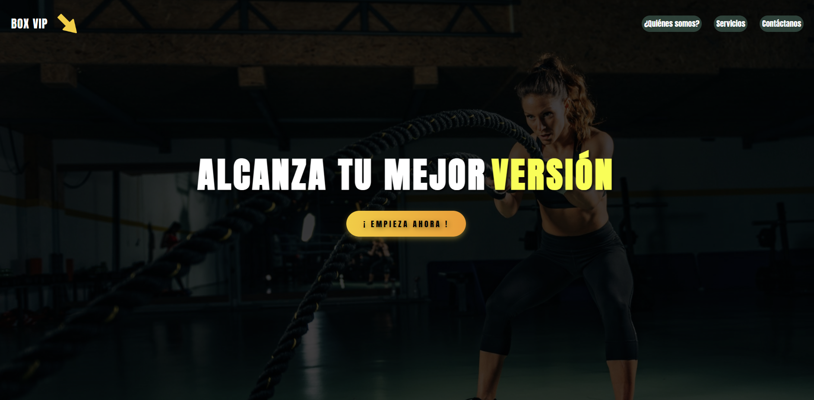

🏋️‍♂️ CrossFit-BOXVIP-Website

Proyecto web realizado para la asignatura de **Lenguaje de Marcas** (Ciclo Superior DAM).  
Representa la página de un centro ficticio de entrenamiento funcional llamado **BOX VIP – Training Center**.

📖 Descripción  
Esta web presenta información del box, sus servicios, formulario de contacto, horarios y propuestas promocionales. Está diseñada con una estructura clara, navegación sencilla y estilo funcional orientado a la práctica de maquetación web.

🚀 Demo Online
🔗 [Ver la página en vivo](https://vpweb.github.io/CrossFit-BOXVIP-Website/)

🎨 Vista previa

🛠️ Tecnologías utilizadas

- HTML5: estructura general.
- CSS3: estilos, diseño y maquetación.
(Opción futura: añadir JS básico para mejorar la interactividad.)

📝 Notas

Este proyecto forma parte del aprendizaje de desarrollo web en Lenguaje de Marcas.
Aunque utiliza HTML y CSS, mi enfoque principal dentro de DAM está orientado a:

- Python
- Java
- MySQL
- Odoo
- Unreal Engine (proyectos personales)

  

